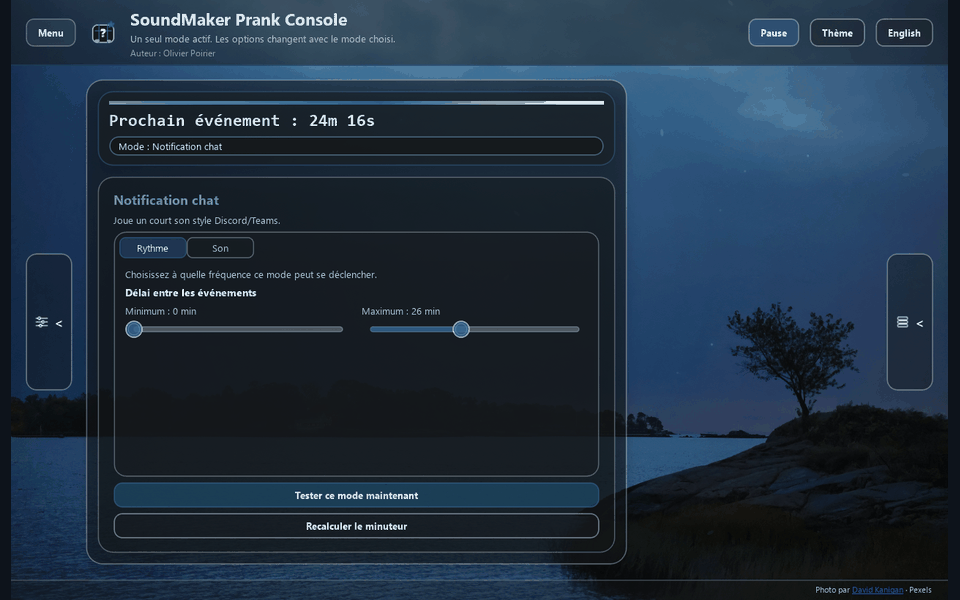
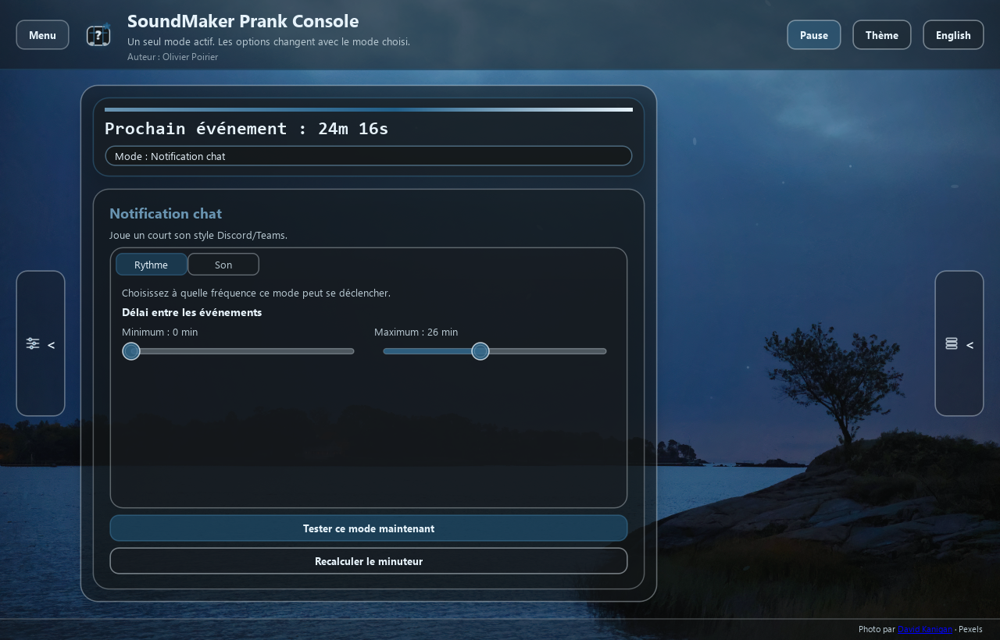
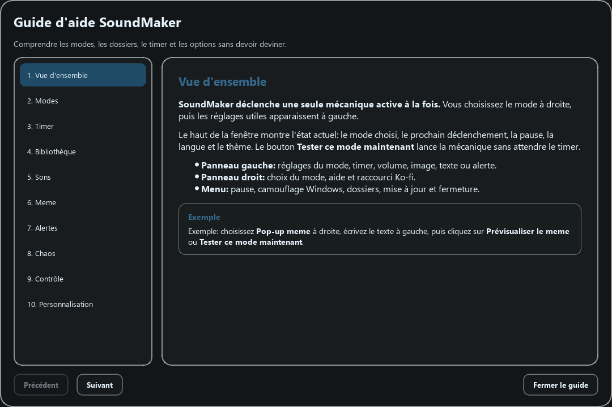

# SoundMaker Prank Console

<p align="center">
  <strong>Une console de farces sonore et visuelle, pensée pour déclencher des moments absurdes sans transformer le bureau en chantier.</strong>
</p>

<p align="center">
  
  
  
  
</p>

<p align="center">
  
</p>

SoundMaker est une application desktop en Python / Qt pour programmer des sons, afficher des pop-ups meme, simuler de fausses alertes et mélanger plusieurs farces dans un mode Chaos. L'app garde une interface propre, thémable et bilingue, avec un timer visible et des réglages qui changent selon le mode sélectionné.

> Projet de blagues: à utiliser avec jugement, sur vos propres machines ou avec des personnes consentantes.

## Aperçu

### Interface principale



### Guide intégré



## Fonctionnalités

- **Timer contrôlé**: pause, reprise, prochain déclenchement visible et recalcul manuel.
- **Modes de farces**: sons aléatoires, son unique, pop-up meme, fausse erreur, son système, notification chat et Chaos.
- **Mode Chaos**: mélange les farces autorisées et accélère progressivement.
- **Bibliothèque locale**: les dossiers `Images/` et `Sounds/` deviennent des catégories dans l'app.
- **Memes personnalisés**: image fixe ou aléatoire, texte haut/bas, couleur, durée et son optionnel.
- **Thèmes visuels**: fonds personnalisés, couleurs dérivées du thème, animations d'ambiance activables.
- **Interface FR/EN**: changement de langue directement dans l'application.
- **Aide intégrée**: guide visuel pour les modes, le timer, la bibliothèque et la personnalisation.
- **Mises à jour**: vérification via les releases GitHub configurées dans `app_config.py`.

## Installation

### Windows

```powershell
python -m venv .venv
.\.venv\Scripts\activate
pip install -r requirements.txt
python main.py
```

### macOS / Linux

```bash
python3 -m venv .venv
source .venv/bin/activate
pip install -r requirements.txt
python main.py
```

L'application utilise le son d'erreur natif quand il est disponible. Sur les plateformes où aucun son système n'est accessible, elle retombe sur un bip portable généré par `pygame`.

## Ajouter du contenu

Placez vos fichiers dans les dossiers locaux:

| Dossier | Utilisation | Formats |
| --- | --- | --- |
| `Sounds/` | sons déclenchés par les modes audio | `.mp3`, `.wav`, `.ogg` |
| `Images/` | images et GIFs pour les memes | `.png`, `.jpg`, `.jpeg`, `.bmp`, `.gif`, `.webp`, `.avif` |
| `assets/themes/` | fonds visuels de l'application | images supportées par Pillow / Qt |

Les sous-dossiers de `Images/` et `Sounds/` deviennent automatiquement des catégories. Après un import ou un changement manuel, utilisez **Rafraîchir** dans l'application pour rescanner la bibliothèque.

## Structure du projet

| Fichier | Rôle |
| --- | --- |
| `main.py` | point d'entrée de l'application |
| `qt_app.py` | coordination de l'interface, des modes et du timer |
| `qt_components.py` | blocs UI réutilisables |
| `qt_widgets.py` | widgets peints sur mesure |
| `qt_dialogs.py` | guide, pop-ups et dialogues thématiques |
| `qt_theme.py` | styles, palettes et couleurs |
| `qt_backdrop.py` | fond animé et extraction de palette |
| `qt_mode_settings.py` | panneaux de réglages par mode |
| `asset_library.py` | scan et gestion des images / sons |
| `audio_manager.py` | lecture audio, volume et fallback sonore |
| `update_manager.py` | vérification des releases GitHub |
| `data/meme_templates.json` | textes de memes sauvegardés |
| `data/preferences.json` | préférences locales de l'utilisateur |

## Configuration utile

- `APP_VERSION` dans `app_config.py`: version affichée par l'application.
- `UPDATE_REPOSITORY` dans `app_config.py`: dépôt GitHub utilisé pour les mises à jour.
- `KO_FI_URL` dans `app_config.py`: lien du bouton de soutien.
- `DEFAULT_LANGUAGE` dans `app_config.py`: langue au premier lancement.

## Captures et médias du README

Les visuels de cette page sont conservés dans `assets/readme/`:

- `soundmaker-tour.gif`
- `soundmaker-main-fr.png`
- `soundmaker-help-fr.png`

Les captures source de l'aide sont aussi présentes dans `assets/help/`, afin que l'app et la documentation puissent évoluer proprement.

## Auteur

Développé par **Olivier Poirier**.

## Licence

Aucune licence publique n'est fournie pour le moment. Ajoutez un fichier `LICENSE` avant toute distribution publique plus large.
